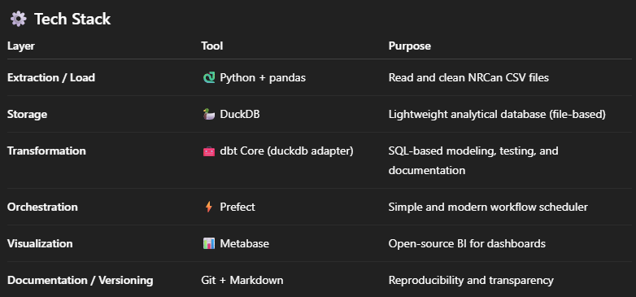

# Data Engineering Portfolio – Jeronimo Dal Piazze

## Crude Oil Exports – Local ETL/ELT Pipeline
DuckDB | dbt Core | Prefect | Metabase | Python

## Overview
This project demonstrates a complete end-to-end data pipeline built entirely with free, lightweight, and local tools.
It automates the process of transforming raw CSV export data from NRCan (Natural Resources Canada) into a structured analytical model and visual dashboards.

The goal is to simulate a modern data-engineering workflow — from ingestion to visualization — using open-source technologies that can easily run on any laptop.

## Objectives
Centralize raw CSVs with version control and metadata for reproducibility.
Automate ingestion and loading of raw data into a lightweight analytical database (DuckDB).
Transform data into clean, modeled layers (staging → marts) using dbt Core.
Orchestrate the pipeline using Prefect, enabling easy re-runs and monitoring.
Visualize insights through Metabase dashboards showing export trends, destinations, and products.

