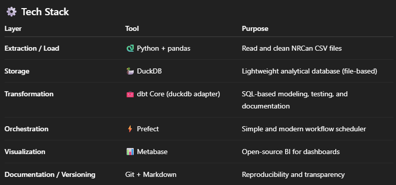

# Data Engineering Portfolio – Jeronimo Dal Piazze

## Crude Oil Exports – Local ETL/ELT Pipeline
DuckDB | dbt Core | Prefect | Metabase | Python

## Overview
This project demonstrates a complete end-to-end data pipeline built entirely with free, lightweight, and local tools.
It automates the process of transforming raw CSV export data from NRCan (Natural Resources Canada) into a structured analytical model and visual dashboards.

The goal is to simulate a modern data-engineering workflow — from ingestion to visualization — using open-source technologies that can easily run on any laptop.

## Objectives
Centralize raw CSVs with version control and metadata for reproducibility.
Automate ingestion and loading of raw data into a lightweight analytical database (DuckDB).
Transform data into clean, modeled layers (staging → marts) using dbt Core.
Orchestrate the pipeline using Prefect, enabling easy re-runs and monitoring.
Visualize insights through Metabase dashboards showing export trends, destinations, and products.



## Project Structure

```text
crude_oil_exports/
├── data/
│   ├── raw/                  # 🗂️ Raw CSV files (NRCan source data)
│   └── docs/                 # 📘 Data dictionaries, metadata, and notes
│
├── warehouse/                # 🦆 DuckDB database file (generated at runtime)
│
├── dbt/
│   ├── dbt_project.yml       # Main dbt project configuration
│   ├── profiles/             # Connection settings (DBT_PROFILES_DIR=./dbt/profiles)
│   │   └── profiles.yml
│   └── models/
│       ├── staging/          # Clean and type the raw layer
│       │   └── stg_exports.sql
│       ├── marts/            # Build facts & dimensions for analysis
│       │   └── fct_exports_monthly.sql
│       └── schema.yml        # dbt tests and documentation
│
├── scripts/
│   └── ingest_csvs.py        # 🐍 Python script to load raw CSVs → DuckDB (raw.exports)
│
├── prefect/
│   └── flow.py               # ⚡ Prefect flow orchestrating ingestion → dbt transformations
│
├── metabase/
│   ├── docker-compose.yml    # 📊 Launch Metabase locally (includes DuckDB connection)
│   ├── README.md             # Connection setup guide
│   └── plugins/              # Folder for the DuckDB JDBC driver (.jar)
│
├── docs/
│   └── architecture.md       # 🧩 Pipeline architecture and explanations
│
├── .env.example              # Environment variable examples
├── .gitignore                # Ignore temporary, data, and environment files
├── requirements.txt          # Python dependencies
├── Makefile                  # 🔧 Predefined commands (ingest, dbt-run, flow, metabase-up)
└── README.md                 # Main project documentation
```